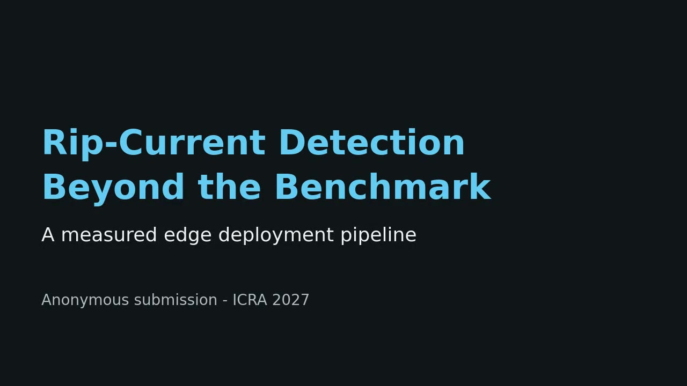

# ripbench-edge (github.com/RipCurrents/ICRA_2027)

Code, result tables, label views, models, measurement scripts and the app for the ICRA 2027 submission
*Rip-Current Detection Beyond the Benchmark: A Measured Edge Deployment Pipeline* (anonymised release).

## Video attachment

`video/icra2027_video.mp4` (155 s, 5.3 MB, H.264): the paper's video attachment; click the image to play it on GitHub.

| Folder | Content |
|---|---|
| `paper/CLAIMS.tsv` | every number in the paper → the file and row it comes from. Start here to check a value. |
| `paper/RESULTS.md` | the provenance ledger kept while the experiments ran (each result with its inputs, settings and date) |
| `paper/TEST_CONSUMPTION.md` | the pre-declaration of every read of the test split |
| `results/` | the result tables the paper is built from; `results/device/` holds the board ledgers behind the deployment section (latency, power, accuracy, camera-window rows) |
| `code/` | the pipeline scripts, one per stage, grouped in `code/README.md` |
| `data/` | training-frame manifest, holdout split, INT8 calibration list, validation-frozen operating points |
| `app/` | the gate → detector app (video file, stream or camera; CPU/onnxruntime, TensorRT on a Jetson) |
| `video/` | the video attachment and its poster frame |

Large artefacts (model exports, checkpoints, per-frame label views, raw device dumps and the full per-window evidence tree) are not
in this repository. They are being re-checked for anonymity and will be attached to a release once they pass; the paper's numbers
are fully traceable from `paper/CLAIMS.tsv` and `results/` without them.

Scripts take no CLI arguments: paths and settings are constants at the top of each file, still naming the original machines' paths
(see `code/README.md`). Code is MIT-licensed; label views and anything derived from RipBench annotations remain under the RipBench licence.
